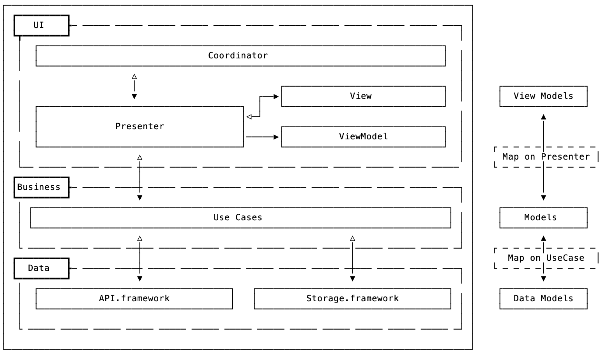

# Expenses Test App in SwiftUI

Expenses app to keep a sane budget. Currency exchange taken from https://currencylayer.com.

I've created this test app to showcase a MVP (Model-View-Presenter) + Coordinators approach in SwiftUI in a fully working app.

There're UseCases for some business logic and accessing resources. And there're 2 frameworks dedicated to make requests to the API and the database: API and Storage respectively. You can only access to those frameworks with the UseCases.

This way there're 3 layers of architecture:

\- UI: MVP + Coordinators

\- Business: UseCases

\- Data: Frameworks API and Storage

Here's a diagram of how it looks like:

## Author

[Luis Ascorbe](https://github.com/Lascorbe) - [@lascorbe](https://twitter.com/Lascorbe)

## Contributing

If you'd like to contribute or make a suggestion, please open a PR.

## License

This project is available under the MIT license. See the [LICENSE](LICENSE) file for more info.